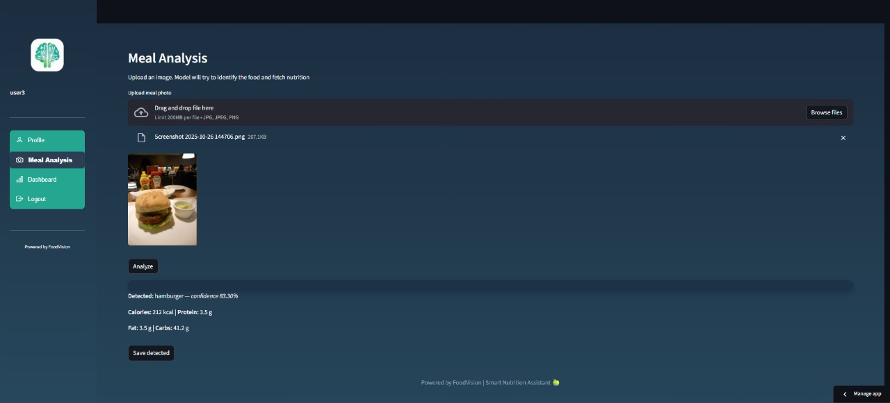
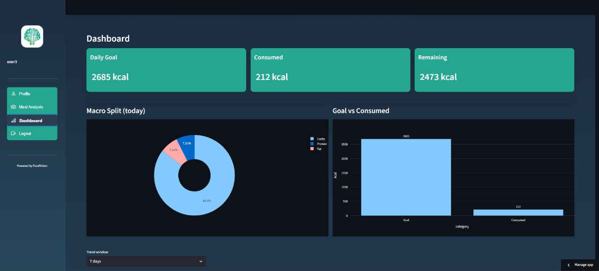
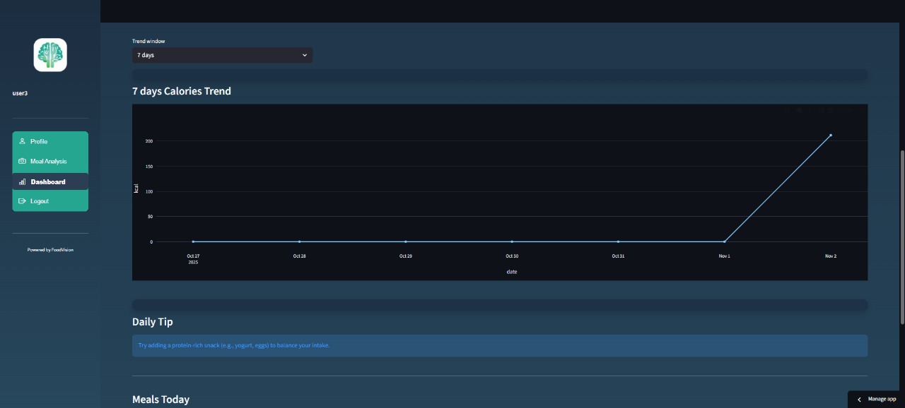
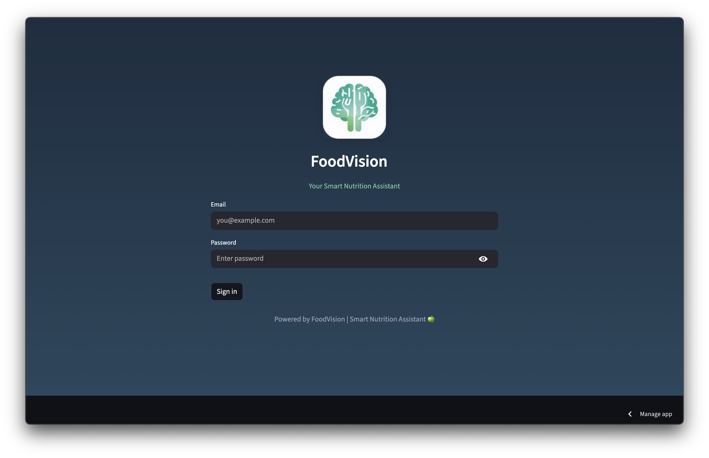

# 🥗 FoodVision

<p align="center">
  
</p>

<p align="center">
  🚀 <b>Try the live app here:</b>
  👉 <a href="https://ru6kuspvgvczcmmetp5xhp.streamlit.app/" target="_blank">https://ru6kuspvgvczcmmetp5xhp.streamlit.app/</a>
</p>

---

**FoodVision** is an AI-powered nutrition analysis platform that helps users understand and manage their diet simply by taking a photo of their meal.
It identifies the food, extracts key nutritional values (calories, carbs, protein, fat), and provides personalized calorie goals and insights — making healthy eating simple, visual, and data-driven.

---

## 🚀 Features

- 📸 **Meal Recognition:** Upload a meal photo and get instant detection using a custom-trained **YOLOv11-small** model.
- 🍎 **Nutrition Estimation:** Automatically retrieves nutritional data (calories, macros) from the **USDA API**.
- 📊 **Interactive Dashboards:** Visualize daily intake, trends, and macronutrient breakdowns.
- 🎯 **Personalized Goals:** Calculates calorie targets based on user height, weight, age, and dietary goal (maintain, lose, or gain weight).
- 💬 **User Feedback:** Allows tracking of undetected meals and continuous model improvement.
- 🔐 **Login System:** Secure authentication flow that enables users to access their personalized data safely.

---

## 🧠 Model Overview

- **Dataset:** [Food101](https://www.kaggle.com/datasets/dansbecker/food-101)
  – 101,000 images (1,000 per class)
- **Model:** YOLOv11-small (classification) with 5.5M parameters
- **Baseline Accuracy:** 66%
- **Final Model Accuracy:** **89%** (after hyperparameter tuning and early stopping at 75 epochs)
- **Inference Speed:** 14.4 ms per image

---

## 🌐 Live Demo

<p align="center">
  <a href="https://ru6kuspvgvczcmmetp5xhp.streamlit.app/" target="_blank">
    
  </a>
</p>

Visit the deployed version here 👉 **[FoodVision on Streamlit](https://ru6kuspvgvczcmmetp5xhp.streamlit.app/)**

---

## 📸 Screenshots

### 🍽️ Meal Analysis Dashboard
<p align="center">
  
</p>

Displays detected food items, nutritional values, and daily goal comparisons.

---

### 📈 Main Dashboard
<p align="center">
  
</p>

Visualizes calorie intake, macronutrient ratios, and overall nutrition trends.

---

### 📊 Extended Dashboard View
<p align="center">
  
</p>

Shows detailed analysis including meal frequency, historical progress, and user engagement insights.

---

### 🔑 Login Page
<p align="center">
  
</p>

Simple and secure login interface allowing users to access their personalized tracking data.

---

## ⚙️ Tech Stack

| Component | Technology |
|------------|-------------|
| **Model** | YOLOv11-small |
| **Dataset** | Food101 |
| **Backend** | Python, FastAPI |
| **Frontend** | Streamlit |
| **Database/API** | Firebase, USDA API |
| **Visualization** | Plotly, Matplotlib |

---

## 🧪 Installation

```bash
# Clone the repository
git clone https://github.com/zMuh/FoodVision.git
cd FoodVision

# Install dependencies
pip install -r requirements.txt

# Run the app locally
streamlit run app/app.py
